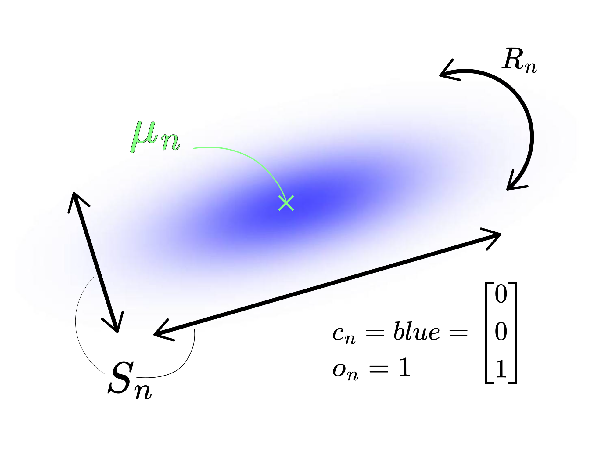
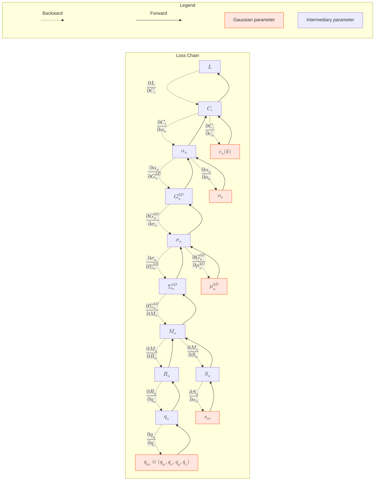
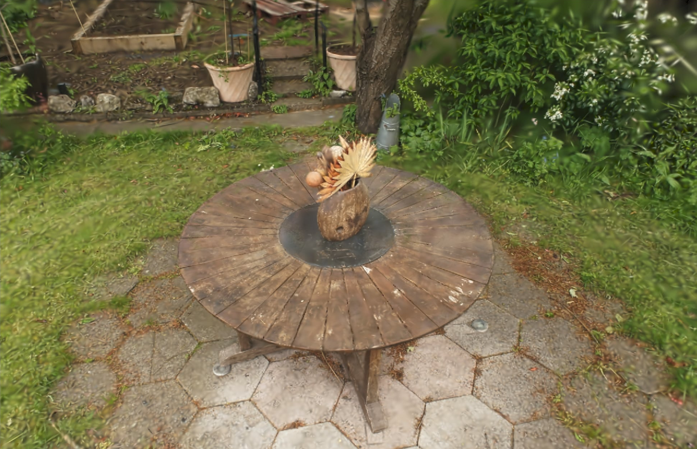

<!-- 
To be replaced in HTML export other than local (either auto or manual replacement):
<link rel="stylesheet" href="https://cdnjs.cloudflare.com/ajax/libs/KaTeX/0.16.0/katex.min.css">
<script type="text/javascript" src="https://cdn.jsdelivr.net/npm/mermaid/dist/mermaid.min.js" charset="UTF-8"></script>
-->

---

# Complete explanations on the gradient descent for a 3D gaussian ray traced, 3D reconstruction algorithm.

## General publication information:

**Author**: Nils Deybach
**Date**: march 19th 2024
**Version**: 1.0.3

### Contact Information
- **Email**: nils.deybach@outlook.com
- **GitHub**: [github.com/ndeybach](https://github.com/ndeybach)

### License
This work is licensed under the Creative Commons Attribution 4.0 International License (CC BY 4.0). You are free to:
- Share — copy and redistribute the material in any medium or format
- Adapt — remix, transform, and build upon the material for any purpose, even commercially

Under the following terms:
- Attribution — You must give appropriate credit, provide a link to the license, and indicate if changes were made to the text in this document.

### Citation
If you use this work in your research, please cite it as:
```
Deybach, N. (2025). Complete explanations on the gradient descent for a 3D gaussian ray traced, 3D reconstruction algorithm.
https://github.com/ndeybach/gaussian-gradient-descent-3DGRT
```

### Repository
The source code of the article and html are available at:
[github.com/ndeybach/gradient-descent-3DGRT](https://github.com/ndeybach/gaussian-gradient-descent-3DGRT)

### Keywords
Gradient Descent, 3D Gaussian, Ray Tracing, Gaussian Splatting, 3DGRT, 3DGUT

### Acknowledgments
Special thanks to NVIDIA researchers[^1] (and their [3DGRT paper](https://gaussiantracer.github.io/)), the gaussian splatting community and open-source contributors who have allowed me by their prior contribution to reach the following explanations by their prior work.

I am also deeply thankful to the gsplat team [^2] for their 3DGS paper. It is the easiest and most well explained gaussian splatting descent that I have read. Arriving in the field without prior knowledge, it was the main source of information that allowed me to come up with the 3D gaussian descent.

---

# Table of content

- [Complete explanations on the gradient descent for a 3D gaussian ray traced 3D reconstruction algorithm.](#complete-explanations-on-the-gradient-descent-for-a-3d-gaussian-ray-traced-3d-reconstruction-algorithm)
  - [General publication information:](#general-publication-information)
    - [Contact Information](#contact-information)
    - [License](#license)
    - [Citation](#citation)
    - [Repository](#repository)
    - [Keywords](#keywords)
    - [Acknowledgments](#acknowledgments)
- [Table of content](#table-of-content)
- [Introduction and Purpose of this article](#introduction-and-purpose-of-this-article)
  - [Personal background before radiance fields](#personal-background-before-radiance-fields)
  - [3DGRT](#3dgrt)
  - [What this article is all about](#what-this-article-is-all-about)
  - [Ray tracing explanations](#ray-tracing-explanations)
  - [General explanations on Gaussian Splatting](#general-explanations-on-gaussian-splatting)
    - [Core Concept](#core-concept)
- [Diagram of the gaussian Ray Traced gradient descent](#diagram-of-the-gaussian-ray-traced-gradient-descent)
  - [Parameters Explanations](#parameters-explanations)
  - [Indices](#indices)
- [Intermediary Parameters and Gradients for 3D Gaussian Ray-Traced Rendering](#intermediary-parameters-and-gradients-for-3d-gaussian-ray-traced-rendering)
  - [Parameters Definitions](#parameters-definitions)
    - [1. Color Contribution along a Ray](#1-color-contribution-along-a-ray)
    - [2. Transparency Accumulation](#2-transparency-accumulation)
    - [3. 3D Gaussian Function](#3-3d-gaussian-function)
    - [4. Covariance Matrix](#4-covariance-matrix)
    - [5. Scale Matrix](#5-scale-matrix)
    - [6. Rotation Matrix (Quaternion Representation)](#6-rotation-matrix-quaternion-representation)
  - [Gradients](#gradients)
    - [1. Gradient on initial loss](#1-gradient-on-initial-loss)
    - [Gradient on Initial Loss](#gradient-on-initial-loss)
      - [Breakdown of the Loss Function Components](#breakdown-of-the-loss-function-components)
      - [Derivative of the Loss Function with Respect to $C_i$](#derivative-of-the-loss-function-with-respect-to-ci)
    - [2. Gradient of Color Contribution](#2-gradient-of-color-contribution)
    - [3. Gradient of Transparency](#3-gradient-of-transparency)
    - [4. Gradient of Gaussian Function](#4-gradient-of-gaussian-function)
    - [5. Gradient of shape parameter Covariance Matrix](#5-gradient-of-shape-parameter-covariance-matrix)
    - [6. Gradient of the gaussian transformation matrix](#6-gradient-of-the-gaussian-transformation-matrix)
    - [7. Gradient of Loss with Respect to Quaternion](#7-gradient-of-loss-with-respect-to-quaternion)
    - [8. Gradient of Scale](#8-gradient-of-scale)
  - [Full Gaussian Parameterization details](#full-gaussian-parameterization-details)
    - [1. 3D Gaussian Function](#1-3d-gaussian-function)
    - [2. Final Compositing Equation](#2-final-compositing-equation)
- [Explicit Chain Rules for Gradient Descent](#explicit-chain-rules-for-gradient-descent)
  - [1. Gradient of Loss w.r.t. Quaternion $( q_i )$](#1-gradient-of-loss-wrt-quaternion-qi)
  - [2. Gradient of Loss w.r.t. Scale Factor $( s_{ni} )$](#2-gradient-of-loss-wrt-scale-factor-sni)
  - [3. Gradient of Loss w.r.t. Gaussian Mean $( \mu_n )$](#3-gradient-of-loss-wrt-gaussian-mean-mu_n)
  - [4. Gradient of Loss w.r.t. Opacity $( o_n )$](#4-gradient-of-loss-wrt-opacity-o_n)
  - [5. Gradient of Loss w.r.t. Color $( c_n(k) )$](#5-gradient-of-loss-wrt-color-c_nk)
- [Gradient Propagation to 3D Parameters intermediary steps explanations](#gradient-propagation-to-3d-parameters-intermediary-steps-explanations)
- [Parameters modifications with respects to the graidents](#parameters-modifications-with-respects-to-the-graidents)
  - [Parameters Modifications with Respect to the Gradients](#parameters-modifications-with-respect-to-the-gradients)
    - [Gradient Descent Update Rule](#gradient-descent-update-rule)
  - [Parameter Updates](#parameter-updates)
    - [1. Position Update $ (\mu_n^{3D}) $](#1-position-update-mu_n3d)
    - [2. Rotation Update (Quaternion) $ (q_n) $](#2-rotation-update-quaternion-q_n)
    - [3. Scale Update $ (s_n) $](#3-scale-update-s_n)
    - [4. Opacity Update $ (o_n) $](#4-opacity-update-o_n)
    - [5. Color Update $ (c_n) $](#5-color-update-c_n)
  - [Gradient descent algorithm quick flow and summary table](#gradient-descent-algorithm-quick-flow-and-summary-table)
- [Result example:](#result-example)
- [Conclusion](#conclusion)
- [Nota Bene:](#nota-bene)
- [Annexes](#annexes)
  - [Annex: Gradients and other mathematical proofs:](#annex-gradients-and-other-mathematical-proofs)
    - [Proof 1: Gradient of Color Contribution](#proof-1-gradient-of-color-contribution)
      - [Gradient with respect to opacity $\alpha_n$:](#gradient-with-respect-to-opacity-alpha_n)
    - [Proof 2: Gradient of Shape Parameter with Respect to the inverse Covariance](#proof-2-gradient-of-shape-parameter-with-respect-to-the-inverse-covariance)
    - [Proof 3: Gradient of Shape Parameter with Respect to the Mean](#proof-3-gradient-of-shape-parameter-with-respect-to-the-mean)
    - [Proof 4: Gradient of the form factor $\sigma_n$ w.r.t Gaussian Transformation Matrix ($M_n$)](#proof-4-gradient-of-the-form-factor-sigma_n-wrt-gaussian-transformation-matrix-m_n)
    - [Proof 5: Gradient of Loss w.r.t Gaussian Transformation Matrix ($M_n$)](#proof-5-gradient-of-loss-wrt-gaussian-transformation-matrix-m_n)
    - [Proof 6: Gradient with Respect to Quaternion Parameters](#proof-6-gradient-with-respect-to-quaternion-parameters)
- [References](#references)

# Introduction and Purpose of this article

## Personal background before radiance fields

Coming from a background in theoretical physics and industrial engineering, and an internship in project management at an industrial water treatment site in Africa, going into the gaussian splatting/radiance fields/computer vision domain was not the most obvious of transitions...

I did computer vision in my high school days on opencv and robotics, and I am also an avid programmer (cut my teeth on C++/Qt, python, javascript/node, and of course bash/linux managing my own server 😁). However, getting back to understanding AI-related algorithms, matrix derivations, encoders, optimisers or Jacobian matrices or the like has not been the smoothest of experiences 👾. Especially as the field is usually the home turf of more senior computer vision artists and researchers already deep in the weeds of brand new shiny techs 😎.

However, I once came across an article by leveleighty that mentioned [gaussian splatting] (https://80.lv/articles/an-ultimate-free-beginner-s-course-on-unreal-engine-5-unveiled/). Intrigued by the technology, I was slowly but surely drawn into it. And in September 2024, when I was done with my final internship in Africa, I decided to give up all job offers and go all in on the radiation fields. Myself and two other associates decided to explore the field and see what we could learn and build with it.

## 3DGRT

One of the paths we explored was 3D Gaussian Ray Traced (3DGRT for intimates) [^1]. It is an improvement on the original 3DGS idea from INRIA [^3]. The techniques require hardware accelerated ray tracing GPUs to be feasible in real time, but the improvements in visual fidelity are massive. So we were interested in how we could use it. However, the code was never released. And as a learning exercise, understanding and implementing it seemed like a good way to dive headfirst into the field in November 2024.

## What this article is all about

A significant challenge encountered was the absence of a comprehensive explanation within the 3DGRT paper [^1] concerning the gradient descent and the overall parametrization of the Gaussian in 3D.
Even in the field of gaussian splatting at large, I at first did not find a well-made explanation of gaussian splatting algorithms before discovering the gsplat paper[^2] and a rather well-made global explanation of the gaussian splatting mathematical parametrization and relation between the gradients. But even it had incoherences inside it, sometimes changed notations and overall just did not describe the 3DGRT gaussian parametrization. I thus started to learn here and there things, destroyed and later rebuilt the mathematics of gaussian to form a parametrization and backpropagation suited for 3DGRT since it was not described by NVIDIA researchers.

Despite promising results, internal considerations have made us diverge from the 3DGRT route. However, I would like to give back to the radiance field community as much as I can, since it allowed me to learn much from such an incredible technique. I hope the following explanation of the gradient descent in 3DGRT (and similarly gaussian ''splatting'') is as clear and understandable as possible and will help others after me.

## Ray tracing explanations

3DGRT and ray tracing is best explained in [^1] [NVIDIA researchers's paper  - arXiv:2407.07090](https://gaussiantracer.github.io/), and I do not think I could do better on that part. Thank you to the amazing team of researchers at NVIDIA for a "newbie compatible" explanation 👌.


*$\hookrightarrow$ 3DGRT ray tracing and BVH collisions explanation by NVIDIA paper*


What is however not described or explained in any form (mathematically or programmatically), is the gradient descent required for the new paradigm. And without it you cannot compute efficiently the gaussian reconstruction.

I will therefore detail in this publication the whole gradient descent applicable for a fully 3D gaussian reconstruction of 3D scenes.

## General explanations on Gaussian Splatting

Gaussian Splatting is a novel approach to 3D scene representation and rendering that has gained significant attention for its speed and visual quality. At its core, it represents a 3D scene as a collection of 3D Gaussian functions (or "splats") rather than using traditional triangle meshes or voxel grids.

### Core Concept

A 3D scene is represented as a point cloud where each point is replaced by a 3D Gaussian function. Each Gaussian is characterized by:

- **Position ($\mu^{3D}_n$)**: The center point of the Gaussian in 3D space
- **Covariance matrix ($\Sigma^{3D}_n$)**: Defines the shape, orientation, and extent of the Gaussian and is generally decomposed into two fundamental parameters:
  - **Rotation ($R_n$)**: A 3×3 rotation matrix typically derived from a quaternion ($q_n$) that defines the orientation of the Gaussian
  - **Scale ($S_n$)**: A diagonal 3×3 matrix containing the scaling factors along the principal axes
  - The covariance is constructed as: $\Sigma^{3D}_n = R_n S_n S_n^T R_n^T$ (further explained later in this article)
- **Color ($c_n$)**: The RGB color values (can be view-dependent through spherical harmonics, more details later)
- **Opacity ($o_n$)**: Controls the transparency of the Gaussian



These Gaussians act as "splats" of color and density that collectively reconstruct the scene when properly positioned and parameterized.

The traditional Gaussian Splatting pipeline is well explained in [this learnopencv article](https://learnopencv.com/3d-gaussian-splatting/) and should give anyone a good first understanding of the classical overall pipeline (without gradient descent specifics). **I highly encourage anyone not already familiar with gaussian splatting and its overall ''classical'' technique to read it before reading this article!**
It explains well the process of rasterizing the 3D gaussian to 2D "screenspace" gaussian for computing reasons.

However, these approximations (and others such as 2D sorting, first-order Jacobians, hit direction approximations, etc.) lead to many small visual artifacts or aberrations.
Many of which NVidia researchers have addressed in 3DGRT and its subsequent 3DGUT papers thanks to a ray traced, fully 3D pipeline. This provides more accurate rendering, especially for transparent media, reflections, and (if extended) complex lighting effects, but at the cost of higher computational complexity and hardware acceleration needs if real-time performance is needed.

# Diagram of the gaussian Ray Traced gradient descent

Since you already learned about general gaussian splatting, I will now dive head first into this article's main problem. The following diagram introduces the gradient descent and overall parameter calculation in the gaussian splatting pipeline. If it is overwhelming at first, do not worry, further step-by-step explanations will follow. If need be, print the diagram and look at it whenever you need 😉.


*$\hookrightarrow$ Fully 3D gaussian splatting gradient descent diagram and parameters computation*

## **Parameters Explanations**

- **$C_i$**: Pixel color or intensity contribution computed by integrating the contributions of Gaussians along a ray $R$. $C_i \in \mathbb{R}^3$ for RGB color space.
- **$c_n(k)$**: Color vector of the 3D Gaussian splat $n$, represented in RGB or other feature domain, $c_n(k) \in \mathbb{R}$ for each RGB channel $k$. Can optionally depend on direction of the ray for better reproduction (spherical harmonics is an example technique that can be used).
- **$\alpha_n$**: alpha (opacity) for the Gaussian splat $n$ at the effective position along the ray and relative to the gaussian (weighted by the gaussian distribution), $\alpha_n \in \mathbb{R}$ for the optimization/compute domain, mapped to $\mathbb{R}^+_0$ for rendering and regularization.
- **$o_n$**: Opacity scalar controlling the transparency of Gaussian splat $n$, $o_n \in \mathbb{R}$ for the optimization domain, mapped to $[0,1]$ for rendering and regularization (or if we look precisely at implementation dependent domain it should be $[\text{pruning\_threshold},\text{max\_threshold}]$, with $\text{pruning\_threshold}$ under which gaussians are pruned (deleted from scene forever), like 0.01 for example because they do not contribute enough anymore; and $\text{max\_threshold}$ to allow gaussians behind others to still contribute).
- **$G^{3D}_n$**: 3D Gaussian function represented by its parameters $(\mu_n, \Sigma_n)$, where $\mu_n$ is the mean and $\Sigma_n$ is the covariance. $G^{3D}_n: \mathbb{R}^3 \rightarrow \mathbb{R}^+$.
- **$\Sigma^{3D}_n$**: 3D covariance matrix parameterizing the orientation, shape, and size of the Gaussian in 3D space, $\Sigma^{3D}_n \in \mathbb{S}^3_{++}$ (positive definite symmetric matrices of dimension 3).
- **$\sigma_n$**: Shape parameter controlling the extent of the Gaussian splat *n* in 3D space, $\sigma_n \in \mathbb{R}^+$, influencing its contribution to **$G^{3D}_n$** and affecting the overall density profile. It defines how "spread out" or "compact" the Gaussian appears along each axis.
- **$\mu^{3D}_n$**: 3D mean (center) position of the Gaussian splat in world coordinates, $\mu^{3D}_n \in \mathbb{R}^3$.
- **$M_n$**: Transformation matrix that combines rotation and scaling to define each Gaussian's orientation and size in the splatting process, $M_n \in \mathbb{R}^{3 \times 3}$.
- **$R_n$**: Rotation matrix derived from the quaternion that orients the 3D Gaussian in world coordinates, $R_n \in \text{SO}(3)$ (special orthogonal group in 3D).
- **$S_n$**: Scale matrix representing the anisotropic scaling of the Gaussian in each spatial direction, $S_n \in \mathbb{R}^{3}_{++}$ (positive diagonal matrices of dimension 3).
- **$s_{ni}$**: Scale factor for a specific axis (x, y, or z) of Gaussian splat $n$, $s_{ni} \in \mathbb{R}^+$.
- **$q_n$**: Quaternion representing the orientation of the Gaussian splat in 3D space, $q_n \in \mathbb{H}_1$ (unit quaternions, isomorphic to $S^3$).
- **$q_{ni}$**: Components of the quaternion $q_n = [q_w,q_x,q_y,q_z]$, where each $q_{ni} \in \mathbb{R}$ with the constraint $\|q_n\| = 1$.

---

## **Indices**
- **i**: Pixel index in the image or ray index during tracing. There could be one or more ray per pixel, usually if one for one, ray i is equivalent to pixel i.
- **k**: Color channel index (e.g., R, G, B) for the Gaussian splat's color representation.
- **n**: Index for the Gaussian splats contributing to the ray.

---

# Intermediary Parameters and Gradients for 3D Gaussian Ray-Traced Rendering

## Parameters Definitions

This chapter will detail how each parameter is obtained (without too much details, these are available further down). It is important to note that all "base" parameters ($\text{gaussian center: }\mu_n^{3D} ; \text{gaussian center: }q_n ; \text{gaussian scaling: }s_n ; \text{gaussian opacity: }o_n ; \text{gaussian color: }c_n$), are for gradient traversal reasons in $\mathbb{R}$ space (see ).

### 1. Color Contribution along a Ray

During the traversal of a ray, each gaussian contribution is taken into account (colorwise for now) by:

$$
\begin{equation}
C_{i}(k) = \sum_{n \in N} c_n \times \alpha_n \times T_n
\end{equation}
$$

Where:
- $C_i(k)$ represents the color contribution along ray $i$ for color channel $k$.
- $N$ is the set of Gaussians encountered along ray $i$.
- $c_n$ is the color value at sample point $n$.
> To make the color more realistic, it is possible to have the color be dependent on the direction of the incoming ray. One of the techniques commonly used is to use spherical harmonics. The more degrees the spherical harmonic has, the more direction dependent the result will be (with a trade off of a higher computation cost). The basic formula of the spherical harmonics is (and as described in [^1]):
$$
\begin{equation}
c_{n}(k,d) = \phi_{\beta}(\mathbf{d}) = f \left( \sum_{\ell=0}^{\ell_{\max}} \sum_{m=-\ell}^{\ell} \beta_{\ell}^{m} Y_{\ell}^{m} (\mathbf{d}) \right)
\end{equation}
$$
where \( f \) is the sigmoid function to normalize the colors.
- $\alpha_n$ is the opacity value at sample point $n$, computed as:
  $$
  \begin{equation}
  \alpha_n = o_n (1 - \exp(-\sigma_n))
  \end{equation}
  $$
  where $o_n$ is the base opacity and $\sigma_n$ controls the spread. <br><br>
- $T_n$ is the accumulated transparency, accumulating the complement of opacity of each gaussian between the camera's pixel i up to the gaussian crossed $n$. Thus measuring something akin to the the transmittance allowed by the gaussians in front of gaussian n.

The equation computes how each sample point along a ray contributes to the final color by multiplying its color value with its opacity and accumulated transparency. The sum over $N$ aggregates all these contributions along the ray path.

### 2. Transparency Accumulation

Along the ray, each effective opacity $\alpha_j$ is accumulated into a transparency intermediary that we denote as $T_n$:

$$
\begin{equation}
T_n = \prod_{j=1}^{n-1} (1 - \alpha_j)
\end{equation}
$$

### 3. 3D Gaussian Function

$$
\begin{equation}
\begin{split}
G_n^{3D}(x) &= \exp \left( -\frac{1}{2} (x - \mu_n^{3D})^T (\Sigma_n^{3D})^{-1} (x - \mu_n^{3D}) \right)  \\
G_n^{3D}(x) &= \exp \left( -\frac{1}{2} (\Delta_n^{3D})^T (\Sigma_n^{3D})^{-1} (\Delta_n^{3D}) \right)  \\
&= \exp(-\sigma_n)
\end{split}
\end{equation}
$$

> where $\Delta_n^{3D} = x - \mu_n^{3D}$ represents the offset from the Gaussian mean. Considering the rays hit in a continuous manner, x represents the most effective hit position. You could also integrate over the ray path for a better result that accounts for densities superpositions but it would probably need a different primitive with more easily integrable densities. <br>
In the scope of gaussian ray tracing $x$ can be obtained from the intrinsics ($R$ and $S$) of the gaussian (noted later $n$) which polyhedron was hit by the ray $i$ descent's (as described in NVIDIA's paper):
>$$
\begin{equation}
x = o + \tau_{max} \times d
\end{equation}
>$$
>Where:
>- $o_n \in \mathbb{R}^3$ represents the origin of the ray hitting the gaussian $n$.
>- $\tau_{max}$ is the length of distance to the point of maximum response of Gaussians encountered along ray $i$. (3x1 position). It is defined by the paper (for ease of computation and first order approximation) as:
>$$
\begin{equation}
\tau_{max} = \frac{(\mu_n - o_n)^\top \Sigma^{-1}_n d_n}{d_n^\top \Sigma^{-1}_n d_n} = \frac{-o_{ng}^\top d_{ng}}{d_{ng}^\top d_{ng}}
\end{equation}
>$$
>where $o_{ng} = S_n^{-1} R_n^T (o - \mu)$ and $d_{ng} = S_n^{-1} R_n^T d$.
>- $d_n \in \mathbb{R}^3$ is the normalized direction vector of the ray hitting the gaussian $n$.
> All those factors are obtained by any standard ray tracing algorithm (such as optix in the case of nvidia). The only other relevant element that is specific to the ray traced rendering is how you create the vertices of the polyhedron. In the case of NVIDIA's choice, they implement it with a stretched icosahedron

### 4. Covariance Matrix

The covariance matrix is a combination of the rotation matrix and scale matrix such as:
$$
\begin{equation}
\begin{split}
\Sigma_n^{3D} &= R_n S_n S_n^\top R_n^\top \\
&= R_n S_n S_n R_n^\top \\
&= M_n M_n^\top
\end{split}
\end{equation}
$$
> Since $S_n$ is a symmetric, diagonal matrix.

### 5. Scale Matrix
$$
\begin{equation}
S_n = \text{diag}(s_{n1}, s_{n2}, s_{n3})
\end{equation}
$$

### 6. Rotation Matrix (Quaternion Representation)
Given a quaternion $q_n = [w, x, y, z]$, the rotation matrix $R_n$ is:
$$
\begin{equation}
R_n = \begin{bmatrix}
1 - 2(y^2 + z^2) & 2(xy - wz) & 2(xz + wy) \\
2(xy + wz) & 1 - 2(x^2 + z^2) & 2(yz - wx) \\
2(xz - wy) & 2(yz + wx) & 1 - 2(x^2 + y^2)
\end{bmatrix}
\end{equation}
$$

---

## Gradients

In this section, I will provide a complete overview of the gradients necessary for the 3D Gaussian Ray Traced reconstruction algorithm. We'll examine each gradient component in detail, starting with the initial loss function and working through the chain rule to derive gradients for all Gaussian parameters.

### 1. Gradient on initial loss

### Gradient on Initial Loss

In the context of **3D Gaussian Ray-Traced Reconstruction**, the initial loss function is designed to balance pixel-wise accuracy with structural fidelity. The corrected initial loss function is defined as:

$$
\begin{equation}
\mathcal{L} \;=\; (1 - \lambda)\,\mathcal{L}_1 \;+\; \lambda\,\mathcal{L}_{\text{D-SSIM}}
\end{equation}
$$

#### Breakdown of the Loss Function Components

- **$\mathcal{L}$**:
  This is the **overall loss** that the optimization process aims to minimize. It quantifies the discrepancy between the reconstructed 3D model and the observed rendering.
  Minimizing $\mathcal{L}$ ensures that the reconstructed model closely matches the target rendering and a correct visual reconstruction.

- **$\mathcal{L}_1$**:
  Represents the **primary loss metric**, focusing on the intensity-based error between the reconstructed image and the ground truth. Common implementations include:
   - **Mean Squared Error (MSE)**:
     $$\begin{equation}\mathcal{L}_{\text{MSE}} = \frac{1}{N} \sum_{i=1}^{N} (C_i - \hat{C}_i)^2\end{equation}$$
   - **Mean Absolute Error (MAE)**:
     $$\begin{equation}\mathcal{L}_{\text{MAE}} = \frac{1}{N} \sum_{i=1}^{N} |C_i - \hat{C}_i|\end{equation}$$
     where:
     - $N$ is the number of pixels or rays.
     - $C_i$ is the predicted color/intensity for the $i$-th pixel or ray.
     - $\hat{C}_i$ is the ground truth color/intensity for the $i$-th pixel or ray.

  I would advise on MSE for a quicker convergence, but learning rates would need to be more finely tuned for the material at hand. For a general, tried and true approach, *prefer MAE*.<br><br>

  It represents the primary loss metric, or more *physically speaking*, the intensity-based error. It can be implemented with multiple algorithms. Examples are mean squared error (MSE) or mean absolute error (MAE). In some contexts, this can be viewed as the straightforward "pixel-wise" or "ray-wise" difference from a reference/ground truth pixel/ray.
  It ensures that the reconstructed image does not deviate significantly from the observed rendering at **the local (pixel or ray) level**, providing a foundational accuracy constraint.<br><br>

- **$\mathcal{L}_{\text{D-SSIM}}$**:
   It represents the **Structural Dissimilarity** component of the loss. It quantifies the structural differences between the reconstructed image and the ground truth using the Structural Similarity Index Measure (SSIM):
   $$\begin{equation}\mathcal{L}_{\text{D-SSIM}} = 1 - \text{SSIM}(C, \hat{C})\end{equation}$$
   where:
   - $\text{SSIM}(C, \hat{C})$ measures the similarity between two images, considering luminance, contrast, and structure.
   While $\mathcal{L}_1$ ensures pixel-wise accuracy, $\mathcal{L}_{\text{D-SSIM}}$ preserves the **structural integrity** of the reconstructed image. This is crucial for maintaining the perceptual quality and ensuring that important features and textures are accurately represented at **the regional level**. The method to achieve this is a bit outside the scope of this publication and I invite the reader [to read relevant documentation on the subject](https://en.wikipedia.org/wiki/Structural_similarity_index_measure#Structural_Dissimilarity).

- **$\lambda \in [0, 1]$**:
   A **weighting parameter** that balances the influence of the primary loss $\mathcal{L}_1$ against the structural dissimilarity loss $\mathcal{L}_{\text{D-SSIM}}$.
   By adjusting $\lambda$, one can control the trade-off between achieving high pixel-wise accuracy and preserving structural features.
   **$\lambda = 0.2$** is a quite safe starting value.

By computing the gradient $\frac{\partial \mathcal{L}}{\partial C_i}$ and backpropagating it through the network of Gaussian parameters, the optimization process iteratively adjusts the model to minimize the loss, resulting in a high-quality 3D reconstruction.

#### Derivative of the Loss Function with Respect to $C_i$

To perform gradient descent optimization, we need to compute the derivative of the loss $\mathcal{L}$ with respect to each pixel or ray contribution $C_i$:

$$\begin{equation}\frac{\partial \mathcal{L}}{\partial C_i} = (1 - \lambda)\,\frac{\partial \mathcal{L}_1}{\partial C_i} \;+\; \lambda\,\frac{\partial \mathcal{L}_{\text{D-SSIM}}}{\partial C_i}.\end{equation}$$

- **$\frac{\partial \mathcal{L}_1}{\partial C_i}$**:
  - For **MSE**:
  $$\begin{equation}\frac{\partial \mathcal{L}_{\text{MSE}}}{\partial C_i} = \frac{2}{N} (C_i - \hat{C}_i)\end{equation}$$
  - For **MAE**:
  $$\begin{equation}\frac{\partial \mathcal{L}_{\text{MAE}}}{\partial C_i} = \frac{1}{N} \cdot \text{sign}(C_i - \hat{C}_i)\end{equation}$$

- **$\frac{\partial \mathcal{L}_{\text{D-SSIM}}}{\partial C_i}$**:
  - The derivative of the SSIM-based loss is more complex and involves the partial derivatives of the SSIM index with respect to $C_i$.
  - This term ensures that changes in $C_i$ not only reduce pixel-wise errors but also enhance structural similarity.

Both can be automated with most compute frameworks and I will not dive further on this aspect. A typical code for this would be something like this with pytorch:

``` python
import torch
import torch.nn.functional as F
from ssim import ssim # use library of your choice

def compute_loss_gradient(gaussian_render_image, target_image):

    # Normalize inputs between 0 and 1 (if 8bit images, divide by max_value)
    gaussian_render_image = gaussian_render_image / max_value
    target_image = target_image / max_value
    
    # Prepare for gradient computation, mark as the variable to do the gradient w.r.t
    gaussian_render_image = gaussian_render_image.requires_grad_(True)
    
    # Compute error metrics
    error_metric1 = F.l1_loss(gaussian_render_image, target_image)
    
    # Compute similarity-based loss
    disimilarity_loss = 1.0 - ssim(
        gaussian_render_image,
        target_image
    )
    
    # Combine losses with adjusted weights
    total_loss = 0.8 * error_metric1 + 0.2 * disimilarity_loss
    
    # Compute the gradient
    total_loss.backward()
    
    # Get and normalize gradient
    gradient = gaussian_render_image.grad / gaussian_render_image.grad.norm()
    return gradient
```

--- 

### 2. Gradient of Color Contribution

Let's remember that:

$$
C_{i}(k) = \sum_{n \in N} c_n \times \alpha_n \times T_n
$$

Now, we have:

$$
\begin{equation}
\frac{\partial C_i(k)}{\partial c_n(k)} = \alpha_n T_n
\end{equation}
$$
$$
\begin{equation}
\frac{\partial C_i(k)}{\partial \alpha_n} = c_n(k) T_n - \frac{S_n(k)}{1 - \alpha_n}
\end{equation}
$$

> where $S_n(k)$ represents the accumulated (back to front since it is a backward traversal) contribution of samples along the ray. It is also expressed as:
> $$
> \begin{equation}
> S_n(k) = \sum_{m>n} c_i(k) \alpha_m T_m
> \end{equation}
> $$

> If $S_n(k)$ is computed after a forward pass (thus you have the value of $C_i(k)$ of the color at pixel i), it can also take the value of:
> $$
> \begin{equation}
> S_n(k) = C_i(k) - \sum_{m\leq n} c_m(k) \alpha_m T_m
> \end{equation}
> $$
> This is usefull because in ray tracing the ray ''standard'' evolution is from the camera plane up to the far plane/end of frustrum (infinity, or closer for computational purposes). This would require first tracing a ray, storing the values of each "hit", then compute the product. It would consume memory and reduce efficiency with a backward loop. A rewrite in the direction of the ray is thus usefull to save on compute ressources.

### 3. Gradient of Transparency

If we take a look at the gradient of transparency w.r.t. opacity we have:

$$
\begin{equation}
\frac{\partial \alpha_n}{\partial o_n} = \exp(-\sigma_n)
\end{equation}
$$

And w.r.t. 3D Gaussian function we have:
$$
\begin{equation}
\frac{\partial \alpha_n}{\partial G_n^{3D}} = o_n
\end{equation}
$$


### 4. Gradient of Gaussian Function
Relative to the shape parameter of the gaussian function $\sigma_n$:
$$
\begin{equation}
\frac{\partial G_n^{3D}}{\partial \sigma_n} = -\exp(-\sigma_n) = - G_n^{3D}
\end{equation}
$$


### 5. Gradient of shape parameter Covariance Matrix
- Relative to the 3D mean dependent gradient $\mu_n^{3D}$:
$$
\begin{equation}
\frac{\partial \sigma_n}{\partial \mu_n^{3D}} = -(\Sigma_n^{3D})^{-1} \Delta_n^{3D}
\end{equation}
$$
> where $\Delta_n^{3D} = x - \mu_n^{3D}$ represents the offset from the Gaussian mean.

- Relative to the 3D covariance $\Sigma_n^{3D}$:
$$
\begin{equation}
\frac{\partial \sigma_n}{\partial \Sigma_n^{3D}} = -\frac{1}{2} (\Sigma_n^{3D})^{-1} \Delta_n^{3D} (\Delta_n^{3D})^T (\Sigma_n^{3D})^{-1}
\end{equation}
$$

### 6. Gradient of the gaussian transformation matrix

$$
\begin{equation}
\frac{\partial \mathcal{L}}{\partial M_n} = \frac{\partial \mathcal{L}}{\partial \Sigma_n^{3D}} M_n + \left(\frac{\partial \mathcal{L}}{\partial \Sigma_n^{3D}} \right)^T M_n
\end{equation}
$$

### 7. Gradient of Loss with Respect to Quaternion
Let $q_n = [w_{n}, x_{n}, y_{n}, z_{n}]$, and the general case of $q = [w, x, y, z]$, then:
$$
\begin{align}
\frac{\partial R}{\partial w} &= 2 \begin{bmatrix} 0 & -z & y \\ z & 0 & -x \\ -y & x & 0 \end{bmatrix} \\
\frac{\partial R}{\partial x} &= 2 \begin{bmatrix} 0 & y & z \\ y & -2x & -w \\ z & w & -2x \end{bmatrix} \\
\frac{\partial R}{\partial y} &= 2 \begin{bmatrix} -2y & x & w \\ x & 0 & z \\ -w & z & -2y \end{bmatrix} \\
\frac{\partial R}{\partial z} &= 2 \begin{bmatrix} -2z & -w & x \\ w & -2z & y \\ x & y & 0 \end{bmatrix}
\end{align}
$$

### 8. Gradient of Scale
For $S_n = \text{diag}(s_{n1}, s_{n2}, s_{n3})$:
$$
\begin{equation}
\frac{\partial S}{\partial s_{ni}} = \delta_{ij}
\end{equation}
$$

> where $\delta_{ij}$ is the Kronecker delta, defined as:
> $$
> \begin{equation}
> \delta_{ij} = \begin{cases} 1 & \text{if } i = j \\ 0 & \text{if } i \neq j \end{cases}
> \end{equation}
> $$

> *(As an example, for the 3×3 case as in the 3D gaussian descent, this is equivalent to:)*
> $$
> \begin{equation}
> \begin{bmatrix}
> 1 & 0 & 0 \\
> 0 & 1 & 0 \\
> 0 & 0 & 1
> \end{bmatrix}
> \end{equation}
> $$

---

## Full Gaussian Parameterization details

In this section I will detail a bit more some 

### 1. 3D Gaussian Function
The 3D Gaussian function is:
$$
\begin{equation}
G_n^{3D}(x) = \exp \left( -\frac{1}{2} (x - \mu_n^{3D})^T (\Sigma_n^{3D})^{-1} (x - \mu_n^{3D}) \right)
\end{equation}
$$

### 2. Final Compositing Equation
$$
\begin{equation}
\boxed{
\begin{split}
C_i &= \sum_{n \in N} c_n \alpha_n \prod_{m=1}^{n-1} (1 - \alpha_m) \\[23pt]
    &= \sum_{n \in N} c_n \alpha_n \prod_{m<n} (1 - \alpha_m)
\end{split}
}
\end{equation}
$$
> where $m<n$ ensures that compositing respects the order of contributions of the Gaussians: accumulated from the camera pixel up to gaussian n alogn the ray.
> In ray tracing the ray ''standard'' evolution is from the camera plane up to the far plane/end of frustrum (infinity, or closer for computational purposes).

---

# **Explicit Chain Rules for Gradient Descent**

This chapter will detail all the gradients of the 5 main parameters.

## **1. Gradient of Loss w.r.t. Quaternion $( q_i )$**

$$
\begin{equation}
{\small
\boxed{\frac{\partial \mathcal{L}}{\partial q_i}} = \left(
\left( \frac{\partial \mathcal{L}}{\partial C_i} \cdot
\frac{\partial C_i}{\partial \alpha_n} \cdot
\frac{\partial \alpha_n}{\partial G_n^{3D}} \cdot
\frac{\partial G_n^{3D}}{\partial \sigma_n} \cdot
\frac{\partial \sigma_n}{\partial \Sigma_n^{3D}} \right) M_n + 
\left( \frac{\partial \mathcal{L}}{\partial C_i} \cdot
\frac{\partial C_i}{\partial \alpha_n} \cdot
\frac{\partial \alpha_n}{\partial G_n^{3D}} \cdot
\frac{\partial G_n^{3D}}{\partial \sigma_n} \cdot
\frac{\partial \sigma_n}{\partial \Sigma_n^{3D}} \right)^T M_n \right) \cdot
\frac{\partial M_n}{\partial R_n} \cdot
\frac{\partial R_n}{\partial q_{ni}}
}
\end{equation}
$$

>Fully substituted:
>$$
\begin{equation}
\begin{split}
\frac{\partial \mathcal{L}}{\partial q_{ni}} = 
\underbrace{S}_{\frac{\partial M_n}{\partial R_n}} \cdot
\underbrace{\frac{\partial R_n}{\partial q_{ni}}}_{\text{see Gradients - 7.}}\cdot
\Biggl( 
    \underbrace{
        \frac{\partial \mathcal{L}}{\partial C_i(k)}
        \cdot 
        \left( c_n(k)\,T_n - \frac{S_n(k)}{1 - \alpha_n} \right)
        \cdot 
        (o_n)
        \cdot 
        (\color{brown}{\cancel{\color{grey}-}} \color{normalcolor}G_n^{3D})
        \cdot 
        \left( \color{brown}{\cancel{\color{grey}-}} \color{normalcolor}\frac{1}{2} (\Sigma_n^{3D})^{-1} \Delta_n^{3D} (\Delta_n^{3D})^T (\Sigma_n^{3D})^{-1} \right)
    }_{\frac{\partial \mathcal{L}}{\partial \Sigma_n^{3D}}} \cdot
    M_n 
    + \\
    \left( 
        \underbrace{
            \frac{\partial \mathcal{L}}{\partial C_i(k)}
            \cdot 
            \left( c_n(k)\,T_n - \frac{S_n(k)}{1 - \alpha_n} \right)
            \cdot 
            (o_n)
            \cdot 
            (\color{brown}{\cancel{\color{grey}-}} \color{normalcolor}G_n^{3D})
            \cdot 
            \left( \color{brown}{\cancel{\color{grey}-}} \color{normalcolor}\frac{1}{2} (\Sigma_n^{3D})^{-1} \Delta_n^{3D} (\Delta_n^{3D})^T (\Sigma_n^{3D})^{-1} \right)
        }_{\frac{\partial \mathcal{L}}{\partial \Sigma_n^{3D}}}
    \right)^T \cdot
    M_n 
\Biggl)
\end{split}
\end{equation}
>$$
---

## **2. Gradient of Loss w.r.t. Scale Factor $( s_{ni} )$**

$$
\begin{equation}
{\small
\boxed{\frac{\partial \mathcal{L}}{\partial s_{ni}}} = 
\frac{\partial M_n}{\partial S_n} \cdot
\frac{\partial S_n}{\partial s_{ni}} \cdot
\left(
\left( \frac{\partial \mathcal{L}}{\partial C_i} \cdot
\frac{\partial C_i}{\partial \alpha_n} \cdot
\frac{\partial \alpha_n}{\partial G_n^{3D}} \cdot
\frac{\partial G_n^{3D}}{\partial \sigma_n} \cdot
\frac{\partial \sigma_n}{\partial \Sigma_n^{3D}} \right) M_n + 
\left( \frac{\partial \mathcal{L}}{\partial C_i} \cdot
\frac{\partial C_i}{\partial \alpha_n} \cdot
\frac{\partial \alpha_n}{\partial G_n^{3D}} \cdot
\frac{\partial G_n^{3D}}{\partial \sigma_n} \cdot
\frac{\partial \sigma_n}{\partial \Sigma_n^{3D}} \right)^T M_n \right)
}
\end{equation}
$$


>Fully substituted:
>$$
\begin{equation}
\begin{split}
\normalsize {
\frac{\partial \mathcal{L}}{\partial s_{ni}} = 
\underbrace{R^T}_{\frac{\partial M_n}{\partial S_n}} \cdot
\underbrace{\delta_{ij}}_{\frac{\partial S_n}{\partial s_{ni}}} \cdot
\Biggl( 
    \underbrace{
        \frac{\partial \mathcal{L}}{\partial C_i(k)}
        \cdot 
        \left( c_n(k)\,T_n - \frac{S_n(k)}{1 - \alpha_n} \right)
        \cdot 
        (o_n)
        \cdot 
        (\color{brown}{\cancel{\color{grey}-}} \color{normalcolor}G_n^{3D})
        \cdot 
        \left( \color{brown}{\cancel{\color{grey}-}} \color{normalcolor}\frac{1}{2} (\Sigma_n^{3D})^{-1} \Delta_n^{3D} (\Delta_n^{3D})^T (\Sigma_n^{3D})^{-1} \right)
    }_{\frac{\partial \mathcal{L}}{\partial \Sigma_n^{3D}}} \cdot
    M_n} \\
    \normalsize {
    + 
    \left( 
        \underbrace{
            \frac{\partial \mathcal{L}}{\partial C_i(k)}
            \cdot 
            \left( c_n(k)\,T_n - \frac{S_n(k)}{1 - \alpha_n} \right)
            \cdot 
            (o_n)
            \cdot 
            (\color{brown}{\cancel{\color{grey}-}} \color{normalcolor}G_n^{3D})
            \cdot 
            \left( \color{brown}{\cancel{\color{grey}-}} \color{normalcolor}\frac{1}{2} (\Sigma_n^{3D})^{-1} \Delta_n^{3D} (\Delta_n^{3D})^T (\Sigma_n^{3D})^{-1} \right)
        }_{\frac{\partial \mathcal{L}}{\partial \Sigma_n^{3D}}}
    \right)^T \cdot
    M_n 
\Biggl)
}
\end{split}
\end{equation}
>$$

---

## **3. Gradient of Loss w.r.t. Gaussian Mean $( \mu_n )$**

$$
\begin{equation}
\boxed{\frac{\partial \mathcal{L}}{\partial \mu_n^{3D}}} =
\frac{\partial \mathcal{L}}{\partial C_i} \cdot
\frac{\partial C_i}{\partial \alpha_n} \cdot
\frac{\partial \alpha_n}{\partial G_n^{3D}} \cdot
\frac{\partial G_n^{3D}}{\partial \sigma_n} \cdot
\frac{\partial \sigma_n}{\partial \mu_n^{3D}}
\end{equation}
$$

>Fully substituted:
>$$
\begin{equation}
\begin{split}
\frac{\partial \mathcal{L}}{\partial \mu_n^{3D}} &= 
    \frac{\partial \mathcal{L}}{\partial C_i(k)} \cdot 
    \underbrace{\left( c_n(k)\,T_n - \frac{S_n(k)}{1 - \alpha_n} \right)}_{\frac{\partial C_i}{\partial \alpha_n}}
    \cdot 
    \underbrace{o_n}_{\frac{\partial \alpha_n}{\partial G_n^{3D}}}
    \cdot 
    \underbrace{(\color{brown}{\cancel{\color{grey}-}} \color{normalcolor}G_n^{3D})}_{\frac{\partial G_n^{3D}}{\partial \sigma_n}}
    \cdot 
    \underbrace{\left( \color{brown}{\cancel{\color{grey}-}} \color{normalcolor} (\Sigma_n^{3D})^{-1} \Delta_n^{3D} \right)}_{\frac{\partial \sigma_n}{\partial \mu_n^{3D}}} \\
    &= 
    \frac{\partial \mathcal{L}}{\partial C_i(k)} \cdot 
    \left( c_n(k)\,T_n - \frac{S_n(k)}{1 - \alpha_n} \right) \cdot 
    o_n \cdot 
    G_n^{3D} \cdot 
    (\Sigma_n^{3D})^{-1} \Delta_n^{3D}
\end{split}
\end{equation}
>$$
---

## **4. Gradient of Loss w.r.t. Opacity $( o_n )$**

$$
\begin{equation}
\boxed{\frac{\partial \mathcal{L}}{\partial o_n}} =
    \frac{\partial \mathcal{L}}{\partial C_i} \cdot
    \frac{\partial C_i}{\partial \alpha_n} \cdot
    \frac{\partial \alpha_n}{\partial o_n}
\end{equation}
$$

>Fully substituted:
> $$
\begin{equation}
\frac{\partial \mathcal{L}}{\partial o_n} 
    =
    \frac{\partial \mathcal{L}}{\partial C_i(k)} \cdot 
    \underbrace{\left( c_n(k)\,T_n - \frac{S_n(k)}{1 - \alpha_n} \right)}_{\frac{\partial C_i}{\partial \alpha_n}} \cdot 
    \underbrace{(1 - \exp(-\sigma_n))}_{\frac{\partial \alpha_n}{\partial o_n}}
\end{equation}
>$$

---

## **5. Gradient of Loss w.r.t. Color $( c_n(k) )$**

$$
\begin{equation}
\boxed{\frac{\partial \mathcal{L}}{\partial c_n(k)}} = 
    \frac{\partial \mathcal{L}}{\partial C_i(k)} 
    \cdot 
    \frac{\partial C_i(k)}{\partial c_n(k)}
\end{equation}
$$

>Fully substituted:
> $$
\begin{equation}
\frac{\partial \mathcal{L}}{\partial c_n(k)} =  
    \frac{\partial \mathcal{L}}{\partial C_i(k)} \cdot 
    \underbrace{(\alpha_n \, T_n)}_{\frac{\partial C_i(k)}{\partial c_n(k)}}
\end{equation}
>$$

---

# Gradient Propagation to 3D Parameters intermediary steps explanations

The steps at the transformation matrix of the gradient descent are not so straightforward and I think a little more detailled explaination is appreciated.

- First we Chain rule leading to the 3D covariance matrix gradient:
$$
\begin{equation}
\begin{split}
    \boxed{\frac{\partial \mathcal{L}}{\partial \Sigma_n^{3D}}} &= 
    \frac{\partial \mathcal{L}}{\partial C_i} \cdot
    \frac{\partial C_i}{\partial \alpha_n} \cdot
    \frac{\partial \alpha_n}{\partial G_n^{3D}} \cdot
    \frac{\partial G_n^{3D}}{\partial \sigma_n} \cdot
    \frac{\partial \sigma_n}{\partial \Sigma_n^{3D}} \\
&= \underbrace{\frac{\partial \mathcal{L}}{\partial C_i(k)}}_{\text{(same factor)}} \cdot
  \underbrace{\Bigl(c_n(k)\,T_n \;-\;\frac{S_n(k)}{1-\alpha_n}\Bigr)}_{\displaystyle \frac{\partial C_i}{\partial \alpha_n}} \cdot
  \underbrace{\bigl(\,o_n\bigr)}_{\displaystyle \frac{\partial \alpha_n}{\partial G_n^{3D}}} \cdot
  \underbrace{\bigl(-\,G_n^{3D}\bigr)}_{\displaystyle \frac{\partial G_n^{3D}}{\partial \sigma_n}} \cdot
  \underbrace{\Bigl(-\,\tfrac12 (\Sigma_n^{3D})^{-1}\,\Delta_n^{3D}\,(\Delta_n^{3D})^T\,(\Sigma_n^{3D})^{-1}\Bigr)}_{\displaystyle \frac{\partial \sigma_n}{\partial \Sigma_n^{3D}}}
\end{split}
\end{equation}
$$

- Then we can obtain the gradient of Loss with respect to transformation matrix $M_n$ from there:
$$
\begin{equation}
\begin{split}
\frac{\partial \mathcal{L}}{\partial M_n} &= \frac{\partial \mathcal{L}}{\partial \Sigma_n^{3D}} M_n + \left(\frac{\partial \mathcal{L}}{\partial \Sigma_n^{3D}}\right)^T M_n \\
 &= \left( \frac{\partial \mathcal{L}}{\partial C_i} \cdot
\frac{\partial C_i}{\partial \alpha_n} \cdot
\frac{\partial \alpha_n}{\partial G_n^{3D}} \cdot
\frac{\partial G_n^{3D}}{\partial \sigma_n} \cdot
\frac{\partial \sigma_n}{\partial \Sigma_n^{3D}} \right) M_n + 
\left( \frac{\partial \mathcal{L}}{\partial C_i} \cdot
\frac{\partial C_i}{\partial \alpha_n} \cdot
\frac{\partial \alpha_n}{\partial G_n^{3D}} \cdot
\frac{\partial G_n^{3D}}{\partial \sigma_n} \cdot
\frac{\partial \sigma_n}{\partial \Sigma_n^{3D}} \right)^T M_n
\end{split}
\end{equation}
$$

>Which can be eventually expended (with minus simplifications) as:
>$$
\begin{equation}
\begin{split}
\frac{\partial \mathcal{L}}{\partial M_n}
&=
\left(\frac{\partial \mathcal{L}}{\partial \Sigma_n^{3D}}\right)\,M_n
\;+\;
\Bigl(\tfrac{\partial \mathcal{L}}{\partial \Sigma_n^{3D}}\Bigr)^{T}\,M_n
\\[6pt]
&=
\Bigl[
  \underbrace{\frac{\partial \mathcal{L}}{\partial C_i(k)}}_{\text{(depends on loss)}}
  \;\underbrace{\Bigl(c_n(k)\,T_n \;-\;\frac{S_n(k)}{1-\alpha_n}\Bigr)}_{\displaystyle \frac{\partial C_i}{\partial \alpha_n}}
  \;\underbrace{\bigl(\,o_n\bigr)}_{\displaystyle \frac{\partial \alpha_n}{\partial G_n^{3D}}}
  \;\underbrace{\bigl(\,\color{brown}{\cancel{\color{grey}-}} \color{normalcolor} G_n^{3D}\bigr)}_{\displaystyle \frac{\partial G_n^{3D}}{\partial \sigma_n}}
  \;\underbrace{\Bigl(\color{brown}{\cancel{\color{grey}-}} \color{normalcolor}\tfrac12 (\Sigma_n^{3D})^{-1}\,\Delta_n^{3D}\,(\Delta_n^{3D})^T\,(\Sigma_n^{3D})^{-1}\Bigr)}_{\displaystyle \frac{\partial \sigma_n}{\partial \Sigma_n^{3D}}}
\Bigr]
\,M_n
\\
&\qquad{}
+\;
\Bigl[
  \underbrace{\frac{\partial \mathcal{L}}{\partial C_i(k)}}_{\text{(same factor)}}
  \;\underbrace{\Bigl(c_n(k)\,T_n \;-\;\frac{S_n(k)}{1-\alpha_n}\Bigr)}_{\displaystyle \frac{\partial C_i}{\partial \alpha_n}}
  \;\underbrace{\bigl(\,o_n\bigr)}_{\displaystyle \frac{\partial \alpha_n}{\partial G_n^{3D}}}
  \;\underbrace{\bigl(\color{brown}{\cancel{\color{grey}-}} \color{normalcolor} G_n^{3D}\bigr)}_{\displaystyle \frac{\partial G_n^{3D}}{\partial \sigma_n}}
  \;\underbrace{\Bigl(\color{brown}{\cancel{\color{grey}-}} \color{normalcolor}\tfrac12 (\Sigma_n^{3D})^{-1}\,\Delta_n^{3D}\,(\Delta_n^{3D})^T\,(\Sigma_n^{3D})^{-1}\Bigr)}_{\displaystyle \frac{\partial \sigma_n}{\partial \Sigma_n^{3D}}}
\Bigr]^{T}
\,M_n.
\end{split}
\end{equation}
>$$

>Proof for this step can be derived with the help of the [Matrix CookBook](https://www.math.uwaterloo.ca/~hwolkowi/matrixcookbook.pdf). See later paragraph.

---

# Parameters modifications with respects to the graidents

## Parameters Modifications with Respect to the Gradients

### Gradient Descent Update Rule
To optimize the **5 primary Gaussian parameters**, we apply gradient descent as follows:

$$
\begin{equation}
q_i^{t+1} = q_i^{t} - \lambda \frac{\partial \mathcal{L}}{\partial q_i}
\end{equation}
$$

where:

- $q_i^t$ is the current value of the parameter at iteration $t$.
- $q_i^{t+1}$ is the updated parameter after the gradient step.
- $\lambda$ is the learning rate controlling the step size.
- $\frac{\partial \mathcal{L}}{\partial q_i}$ is the computed gradient of the loss function with respect to the parameter.

This iterative update adjusts each parameter in the direction that minimizes the reconstruction error.

---

## Parameter Updates

During training, some points are to be noted.

Firstly, the parameters (hereby noted generically $\theta$) should be updated generally in the form of:

$$
\begin{equation}
\theta^{t+1} = \theta^{t} - \lambda \frac{\partial \mathcal{L}}{\partial \theta}
\end{equation}
$$

With: 
- $\theta^{t+1}$ is the updated parameter value at iteration $t+1$
- $\theta^{t}$ is the current parameter value at iteration $t$
- $\lambda$ is the learning rate controlling the step size
- $\frac{\partial \mathcal{L}}{\partial \theta}$ is the gradient of the loss function with respect to parameter $\theta$

This allows converging toward the lesser difference between the grount truth (GT, or input images) and the current 3D modelisation raster obtained from the gaussians.

Secondly, there are some conciderations on each parameters to keep a physically, updatable and normalized update flow of the parameters. Mainly, the parameters in the gradient optimizer (I recommend to follow traditional gsplat implementation of adam or derivative as a bases that works) should be mapped to $[-\infty, +\infty]$ to take advantage of unbounded real values and the dynamic range of float32 types used during training, allowing for a more stable gradient flow.

Thirdly, the learning rates should be determined empirically in a further study if possible. At first glance taking similar order as gsplat or similar 2D gaussian would seem to work.

The first two concerns are detailled in the following subsections for each main parameter update as much as possible.

### 1. Position Update $ (\mu_n^{3D}) $
The **3D position** update follows:

$$
\begin{equation}
\mu_n^{3D, t+1} = \mu_n^{3D, t} - \lambda \frac{\partial \mathcal{L}}{\partial \mu_n^{3D}}
\end{equation}
$$

This moves the Gaussian center in 3D space toward an optimal position that reduces the loss function.

---

### 2. Rotation Update (Quaternion) $ (q_n) $
Since quaternions represent rotations, we must **normalize** them after applying gradient descent:

$$
\begin{equation}
q_n^{t+1} = \text{normalize} \Big( q_n^{t} - \lambda \frac{\partial \mathcal{L}}{\partial q_n} \Big)
\end{equation}
$$

where the **normalization** ensures the updated quaternion remains on the unit hypersphere:

$$
\begin{equation}
\text{normalize}(q) = \frac{q}{\| q \|}
\end{equation}
$$

This maintains numerical stability while optimizing rotation in $\text{SO(3)}$.

---

### 3. Scale Update $ (s_n) $
To ensure positive scaling, we parameterize the **scale factors** as exponentials:

$$
\begin{equation}
s_n = e^{\hat{s}_n}
\end{equation}
$$

which transforms the update into:

$$
\begin{equation}
s_n^{t+1} = s_n^{t} - \lambda \frac{\partial \mathcal{L}}{\partial s_n}
\end{equation}
$$

This guarantees that the scale remains **strictly positive** during optimization.

---

### 4. Opacity Update $ (o_n) $
Opacity is updated using:

$$
\begin{equation}
o_n^{t+1} = o_n^{t} - \lambda \frac{\partial \mathcal{L}}{\partial o_n}
\end{equation}
$$

>Since the normalized opacity $\hat{o}_n$ ([0,1] normalized, not the compute opacity $o_n \in [-\infty,\infty]$ used in the optimizer) must remain in **[0,1]**, you can apply **clipping**. Use 0,999 or a similar not 1 value can be used to allow for the gradient descent to still evolve and not be stuck because the splat becomes opaque and nothing behind can evolve:
>$$
\begin{equation}
\begin{split}
\hat{o}_n^{t+1} &= \text{clip}(\hat{o}_n^{t+1}, 0, 0.999) \\
&= \text{clip}(\text{sigmoid}(o_n^{t+1}), 0, 0.999)
\end{split}
\end{equation}
>$$

---

### 5. Color Update $ (c_n) $
Color values are updated similarly:

$$
\begin{equation}
c_n^{t+1} = c_n^t - \lambda \frac{\partial \mathcal{L}}{\partial c_n}
\end{equation}
$$

>NB:
>To ensure stability in SDR and HDR or other spaces imaging, colors should be first *clipped* within a standard, common range. Such that with a [0,1] space:
>$$
\begin{equation}
\hat{c}_n = \text{clip}(c_{n_{raw}}, 0, 1)
\end{equation}
>$$
>With:
>- $c_{n_{raw}}$ the color as inputed (for exemple as 8bit SDR only values, you would divide by 255 $c_{n_{raw}}$ to clip it to a [0,1] space).
>- $\hat{c}_n$ the intermediary, normalized color 
>And then during training you can work in the full $\mathbb{R}$ space to take full advantage of the dynamic range of your float32 gradient descent (as mentionned earlier):
>$$
\begin{equation}
{c}_n = \text{logit}(\hat{c}_n) = \log\left(\frac{\hat{c}_n}{1-\hat{c}_n}\right)
\end{equation}
>$$
>With ${c}_n$ the color as used by the gradient descent optimizer. <br>
This takes advantage of the logit function (inverse sigmoid) to work with unbounded real values. Allowing for more stable gradient flow.
>And colors are then rendered using the sigmoid + unclipping (back to your original range of values, ie: $\times$255 for SDR 8bit content) back to original space:
>$$
\begin{equation}
c_n^{\text{rendered}} = \text{unclip}(\text{sigmoid}({c}_n)) = \text{unclip}(\frac{1}{1 + e^{-{c}_n}})
\end{equation}
>$$

---

## **Gradient descent algorithm quick flow and summary table**
For each iteration:

1. Compute gradients $\frac{\partial \mathcal{L}}{\partial \theta}$ for each parameter $\theta$.
2. Update each parameter using the rules above.
3. Normalize the quaternion $q_n$ to maintain unit norm.
4. Ensure constraints for positive scales $s_n$, valid opacities $o_n$, and correct color range.
5. Iterate until convergence.

Here is a summary table for a general overview of what was in this chapter:

| Parameter | Update Rule |
|-----------|------------|
| **Position** $ (\mu_n^{3D}) $ | $ \mu_n^{3D, t+1} = \mu_n^{3D, t} - \lambda \frac{\partial \mathcal{L}}{\partial \mu_n^{3D}} $ |
| **Rotation** $ (q_n) $ | $ q_n^{t+1} = \text{normalize}(q_n^t - \lambda \frac{\partial \mathcal{L}}{\partial q_n}) $ |
| **Scale** $ (s_n) $ | $ s_n^{t+1} = s_n^{t} - \lambda \frac{\partial \mathcal{L}}{\partial s_n} $ |
| **Opacity** $ (o_n) $ | $ o_n^{t+1} = o_n^{t} - \lambda \frac{\partial \mathcal{L}}{\partial o_n} $ |
| **Color** $ (c_n) $ | $ c_n^{t+1} = c_n^t - \lambda \frac{\partial \mathcal{L}}{\partial c_n} $ |

---

# Result example:

The following image is the result of an optix + cuda + pytorch algorithm following the implementation described earlier. It did not implement splitting/pruning and is only the gradient descent described above:



For legal reasons I cannot publish the associated code, as I do not have the consent of all parties involved. However, the mathematics described here is an adaptation to 3DGRT of already published mathematics made by me and myself alone (and obviously built upon the shoulders of giants fully disclosed in references and links).

# Conclusion

It is my hope that this detailed explanation of the gradient descent of 3DGRT will prove useful to those new to the field or wishing to build upon 3DGRT. A preliminary review suggests that the gradient descent method may also be applicable to other papers, including EVER [^4].

In my opinion, it serves as an excellent introduction to the mathematical principles underlying Gaussian splatting in general. It even covers the traditional technique with 3D to 2D steps (including projection to screen space and Jacobean in the gradient descent). Some minor adjustments would be required to extend this article. However, this falls outside the scope of my current work and I encourage anyone interested to either add it or contact me to extend the current version of this article with it.

The results obtained without the use of advanced techniques (such as running, splitting, kernel filtering, etc.) appear to confirm the working basics for the gradient descent. I am hopeful that the mathematics in this article will be made open source in the future and that ray tracing will become more accessible in terms of hardware in the coming years.

---

# Nota Bene:

If any error in this article is found, feel free to contact the author for a revision to be made (contacts at the beginning).

---

# Annexes

## Annex: Gradients and other mathematical proofs:

In this section, I present detailed mathematical proofs for the gradient formulations described earlier. These proofs are essential for understanding the derivation of update rules in the 3D Gaussian Ray-Traced reconstruction algorithm.

### Proof 1: Gradient of Color Contribution

We begin by proving the gradients of the color contribution with respect to color and opacity parameters.

#### Gradient with respect to opacity $\alpha_n$:

For the derivative with respect to $\alpha_n$, the situation is more complex because $\alpha_n$ affects not only its own term but also the transparency factors $T_m$ for $m > n$ (recall that n=0 is back of the frustrum and n=N is at the last gaussian before camera plane).

Starting with:

$$
\begin{equation}
C_i(k) = \sum_{m \in N} c_m(k) \times \alpha_m \times T_m
\end{equation}
$$

We separate this into terms before, at, and after index $n$:

$$
\begin{equation}
C_i(k) = \sum_{m < n} c_m(k) \times \alpha_m \times T_m + c_n(k) \times \alpha_n \times T_n + \sum_{m > n} c_m(k) \times \alpha_m \times T_m
\end{equation}
$$

- For $m < n$, the terms are independent of $\alpha_n$, so their derivatives are zero. <br><br>

- For $m = n$:
$$
\begin{equation}
\frac{\partial}{\partial \alpha_n}(c_n(k) \times \alpha_n \times T_n) = c_n(k) \times T_n
\end{equation}
$$

- For $m > n$, we need to consider that $T_m$ depends on $\alpha_n$ through the transparency accumulation. The resulting derivative is:

$$
\begin{equation}
\frac{\partial}{\partial \alpha_n}(c_m(k) \times \alpha_m \times T_m) = c_m(k) \times \alpha_m \times \frac{-T_m}{1-\alpha_n}
\end{equation}
$$

>Let's derive this more explicitly: <br><br>
>First, recall the definition of accumulated transparency:
>$$
\begin{equation}
T_m = \prod_{j=1}^{m-1} (1 - \alpha_j)
\end{equation}
>$$
>We can separate this product to isolate the term containing $\alpha_n$:
>$$
\begin{equation}
\begin{split}
T_m &= \left(\prod_{j=1}^{n-1} (1 - \alpha_j)\right) \times (1-\alpha_n) \times \left(\prod_{j=n+1}^{m-1} (1 - \alpha_j)\right) \\
&= T_n \times (1-\alpha_n) \times \prod_{j=n+1}^{m-1}(1-\alpha_j) \\
\end{split}
\end{equation}
>$$
>Now we take the partial derivative with respect to $\alpha_n$:
>$$
\begin{equation}
\begin{split}
\frac{\partial T_m}{\partial \alpha_n} &= \frac{\partial}{\partial \alpha_n}\left[T_n \times (1-\alpha_n) \times \prod_{j=n+1}^{m-1}(1-\alpha_j)\right] \\
&= -T_n \times \prod_{j=n+1}^{m-1}(1-\alpha_j)
\end{split}
\end{equation}
>$$
>To simplify this further, we note that:
>$$
\begin{align}
T_m &= T_n \times (1-\alpha_n) \times \prod_{j=n+1}^{m-1}(1-\alpha_j) \\
\Leftrightarrow \prod_{j=n+1}^{m-1}(1-\alpha_j) &= \frac{T_m}{T_n \times (1-\alpha_n)}
\end{align}
>$$
>Substituting this back into our derivative:
>$$
\begin{equation}
\begin{split}
\frac{\partial T_m}{\partial \alpha_n} &= -{\color{brown}{\cancel{\color{grey}T_n}}} \times \frac{T_m}{{\color{brown}{\cancel{\color{grey}T_n}}} \times (1-\alpha_n)} \\
&= \frac{-T_m}{1-\alpha_n}
\end{split}
\end{equation}
$$ <br>
>Thus, for $m > n$:
>$$
\begin{equation}
\frac{\partial}{\partial \alpha_n}(c_m(k) \times \alpha_m \times T_m) = c_m(k) \times \alpha_m \times \frac{-T_m}{1-\alpha_n}
\end{equation}
>$$

Combining all terms:
$$
\begin{equation}
\frac{\partial C_i(k)}{\partial \alpha_n} = c_n(k) \times T_n - \sum_{m > n} \frac{c_m(k) \times \alpha_m \times T_m}{1-\alpha_n}
\end{equation}
$$

Recognizing that $S_n(k) = \sum_{m > n} c_m(k) \times \alpha_m \times T_m$ is the accumulated contribution of samples after $n$:

$$
\begin{equation}
\boxed{\frac{\partial C_i(k)}{\partial \alpha_n} = c_n(k) \times T_n - \frac{S_n(k)}{1-\alpha_n}}
\end{equation}
$$

which matches the previous gradient formulation.

### Proof 2: Gradient of Shape Parameter with Respect to the inverse Covariance

Let $\Delta_n^{3D}: (\mathbb{R}^3, \mathbb{R}^3) \rightarrow \mathbb{R}^3, \space\space  \Delta_n^{3D}(x, \mu_n^{3D})= x - \mu_n^{3D}$ and $\sigma_n: (\mathbb{R}^3, \mathbb{R}^{3 \times 3}) \rightarrow \mathbb{R}^3, \space\space \sigma_n(\Delta_n^{3D}, (\Sigma_n^{3D})^{-1}) = \frac{1}{2}\Delta_n^{3D^T} (\Sigma_n^{3D})^{-1} \Delta_n^{3D}$:

Taking the derivative with respect to $\mu_n^{3D}$:

$$
\begin{equation}
\frac{\partial \sigma_n}{\partial \Sigma^{3D}} = \frac{\partial}{\partial \mu_n^{3D}} \left[ \frac{1}{2}\underbrace{(\Delta_n^{3D})^{\top}}_{a^{\top}} (\Sigma_n^{3D})^{-1} \underbrace{\Delta_n^{3D}}_{b} \right]
\end{equation}
$$

Using the identity (70) in [the matrix cookbook](https://www.math.uwaterloo.ca/~hwolkowi/matrixcookbook.pdf):

$$
\begin{equation}
\frac{\partial \mathbf{a}^\top \mathbf{X} \mathbf{b}}{\partial \mathbf{X}} = \mathbf{a} \mathbf{b}^\top
\end{equation}
$$

We thus obtain:

$$
\begin{equation}
\boxed{\frac{\partial \sigma_n}{\partial (\Sigma_n^{3D})^{-1}} = \frac{1}{2}\Delta_n^{3D}(\Delta_n^{3D})^{\top}}
\end{equation}
$$

### Proof 3: Gradient of Shape Parameter with Respect to the Mean

Let $\Delta_n^{3D}: (\mathbb{R}^3, \mathbb{R}^3) \rightarrow \mathbb{R}^3, \space\space  \Delta_n^{3D}(x, \mu_n^{3D})= x - \mu_n^{3D}$ and $\sigma_n: (\mathbb{R}^3, \mathbb{R}^{3 \times 3}) \rightarrow \mathbb{R}^3, \space\space \sigma_n(\Delta_n^{3D}, \Sigma_n^{3D}) = \frac{1}{2}\Delta_n^{3D^T} (\Sigma_n^{3D})^{-1} \Delta_n^{3D}$:

Taking the derivative with respect to $\mu_n^{3D}$:
$$
\begin{align}
\frac{\partial \sigma_n}{\partial \mu_n^{3D}} 
&= \frac{\partial}{\partial \mu_n^{3D}} \left[ \frac{1}{2}\underbrace{(x - \mu_n^{3D})^{\top}}_{(\Delta_n^{3D})^{\top}} (\Sigma_n^{3D})^{-1} \underbrace{(x - \mu_n^{3D})}_{\Delta_n^{3D}} \right] \\
\end{align}
$$

Using the product rule on derivatives and noting that $\frac{\partial \Delta_n^{3D}}{\partial \mu_n^{3D}} = -I$ (since $\Delta_n^{3D} = x - \mu_n^{3D}$):

$$
\begin{equation}
\begin{split}
\frac{\partial \sigma_n}{\partial \mu_n^{3D}} 
&= \frac{1}{2} \frac{\partial}{\partial \mu_n^{3D}} \left[ (\Delta_n^{3D})^{\top} (\Sigma_n^{3D})^{-1} \Delta_n^{3D} \right] \\
&= \frac{1}{2} \left[ \frac{\partial (\Delta_n^{3D})^{\top}}{\partial \mu_n^{3D}} (\Sigma_n^{3D})^{-1} \Delta_n^{3D} + (\Delta_n^{3D})^{\top} (\Sigma_n^{3D})^{-1} \frac{\partial \Delta_n^{3D}}{\partial \mu_n^{3D}} \right] \\
&= \frac{1}{2} \left[ (-I)^{\top} (\Sigma_n^{3D})^{-1} \Delta_n^{3D} + (\Delta_n^{3D})^{\top} (\Sigma_n^{3D})^{-1} (-I) \right] \\
&= \frac{1}{2} \left[ -(\Sigma_n^{3D})^{-1} \Delta_n^{3D} - (\Delta_n^{3D})^{\top} (\Sigma_n^{3D})^{-1} \right] \\
\end{split}
\end{equation}
$$

Since $(\Delta_n^{3D})^{\top} (\Sigma_n^{3D})^{-1}$ is a $1 \times 3$ vector (row vector) and $(\Sigma_n^{3D})^{-1} \Delta_n^{3D}$ is a $3 \times 1$ vector (column vector), and both represent the same mathematical quantity in transposed form (since $\Sigma_n^{3D}$ is symmetric), we can simplify:

$$
\begin{align}
\frac{\partial \sigma_n}{\partial \mu_n^{3D}} 
&= -(\Sigma_n^{3D})^{-1} \Delta_n^{3D}
\end{align}
$$

Therefore:
$$
\begin{equation}
\boxed{\frac{\partial \sigma_n}{\partial \mu_n^{3D}} = -(\Sigma_n^{3D})^{-1} \Delta_n^{3D}}
\end{equation}
$$

### Proof 4: Gradient of the form factor $\sigma_n$ w.r.t Gaussian Transformation Matrix ($M_n$)

Let's remember the following prior proof:

- $\frac{\partial \sigma_n}{\partial (\Sigma_n^{3D})^{-1}} = \frac{1}{2}\Delta_n^{3D}(\Delta_n^{3D})^{\top}$

Furthermore the [the matrix cookbook](https://www.math.uwaterloo.ca/~hwolkowi/matrixcookbook.pdf) gives us :

$$\partial \mathbf{Y}^{-1} = -\mathbf{Y}^{-1} \partial \mathbf{Y} \mathbf{Y}^{-1} \scriptsize\text{(from equation (59) of the matrix \\\ cookbook on the derivative of an inverse)}$$

Which can be rewritten in our case to :
$$
\begin{equation}
\partial \mathbf{{\Sigma_n^{3D}}^{-1}} = -\mathbf{{\Sigma_n^{3D}}^{-1}} \space \partial \mathbf{(\Sigma_n^{3D})} \space \space \mathbf{{\Sigma_n^{3D}}^{-1}}
\end{equation}
$$

From these, using the Frobenius inner product (introduced in gsplat paper if need be) and letting us have $H = \frac{\partial \sigma_n}{\partial {\Sigma_n^{3D}}^{-1}}$ we have:

$$
\begin{equation}
\begin{split}
\partial \sigma_n &= \left\langle \frac{\partial \sigma_n}{\partial {\Sigma_n^{3D}}^{-1}}, \partial {\Sigma_n^{3D}}^{-1} \right\rangle \\
 &= \left\langle H, \partial {\Sigma_n^{3D}}^{-1} \right\rangle \\
 &= \left\langle H, -{\Sigma_n^{3D}}^{-1} \partial (\Sigma_n^{3D}) {\Sigma_n^{3D}}^{-1} \right\rangle \\
 &= \left\langle -({\Sigma_n^{3D}}^{-1})^{\top} H, \partial (\Sigma_n^{3D}) {\Sigma_n^{3D}}^{-1} \right\rangle \\
 &= \left\langle -({\Sigma_n^{3D}}^{-1})^{\top} H ({\Sigma_n^{3D}}^{-1})^{\top}, \partial (\Sigma_n^{3D})  \right\rangle
\end{split}
\end{equation}
$$

Which if we apply the inner product on $\Sigma_n^{3D}$ w.r.t itself we obtain:
$$
\begin{equation}
\boxed{
\begin{split}
\frac{\partial \sigma_n}{\partial {\Sigma_n^{3D}}} &= -({\Sigma_n^{3D}}^{-1})^{\top} \overbrace{\frac{\partial \sigma_n}{\partial {\Sigma_n^{3D}}^{-1}}}^{\text{H}} ({\Sigma_n^{3D}}^{-1})^{\top} \\
&= -({\Sigma_n^{3D}}^{-1})^{\top} \underbrace{\frac{1}{2}\Delta_n^{3D}(\Delta_n^{3D})^{\top}}_{\text{H}} ({\Sigma_n^{3D}}^{-1})^{\top}
\end{split}}
\end{equation}
$$

### Proof 5: Gradient of Loss w.r.t Gaussian Transformation Matrix ($M_n$)

We need to derive $\frac{\partial \mathcal{L}}{\partial M_n}$ based on the chain rule.

Starting with the relationship $\Sigma_n^{3D} = M_n M_n^T$, we need to apply the chain rule:
$$\frac{\partial \mathcal{L}}{\partial M_n} = \frac{\partial \mathcal{L}}{\partial \Sigma_n^{3D}} \frac{\partial \Sigma_n^{3D}}{\partial M_n}$$

To find $\frac{\partial \Sigma_n^{3D}}{\partial M_n}$, we differentiate $\Sigma_n^{3D} = M_n M_n^\top$. 

By using the following rules on the Frobenius inner product:

- $\langle X, Y \rangle = \langle X^{\top}, Y^{\top} \rangle,$
- $(XY)^{\top} = Y^{\top} X^{\top}$
- $\langle X, YZ \rangle = \langle Y^\top X, Z \rangle = \langle XZ^\top, Y \rangle$

Let $F = \frac{\partial \mathcal{L}}{\partial \Sigma_n^{3D}}$.

We then have:

$$
\begin{equation}
\begin{split}
\partial \mathcal{L} &= \left\langle \frac{\partial \mathcal{L}}{\partial \Sigma_n^{3D}}, \partial \Sigma_n^{3D} \right\rangle = \left\langle F, \partial \Sigma_n^{3D} \right\rangle = \left\langle F, \partial (MM^{\top}) \right\rangle \\
&= \left\langle F, \partial (M) M^{\top} \right\rangle + \left\langle F, M \partial (M^{\top}) \right\rangle \\
&= {\color{grey} {\left\langle F, \partial (M) M^{\top} \right\rangle}} + \left\langle F^{\top}, \left( M \partial \left( M^{\top} \right) \right)^{\top} \right\rangle \\
&= {\color{grey} {\left\langle F, \partial (M) M^{\top} \right\rangle}} + \left\langle F^{\top}, \partial(M) M^{\top} \right\rangle \\
&= \left\langle F M, \partial (M) \right\rangle + \left\langle F^{\top}M, \partial(M) \right\rangle \\
&= \left\langle F M + F^{\top}M, \partial(M) \right\rangle
\end{split}
\end{equation}
$$

Which if we replace F and make the partial derivative with respect to the transformation matrix (thus beying an axes of the inner product):

$$
\begin{equation}
\boxed{\begin{split}
\frac{\partial \mathcal{L}}{\partial M_n} &= F M_n + F^{\top} M_n \\
&= \frac{\partial \mathcal{L}}{\partial \Sigma_n^{3D}} M_n + \left(\frac{\partial \mathcal{L}}{\partial \Sigma_n^{3D}}\right)^{\top} M_n
\end{split}}
\end{equation}
$$

### Proof 6: Gradient with Respect to Quaternion Parameters

For the gradient with respect to quaternion parameters, we need to derive how changes in quaternion components affect the rotation matrix $R_n$, which then influences the transformation matrix $M_n$.

Given a quaternion $q_n = [w, x, y, z]$, the rotation matrix $R_n$ is defined as:
$$
\begin{equation}
R_n = \begin{bmatrix}
1 - 2(y^2 + z^2) & 2(xy - wz) & 2(xz + wy) \\
2(xy + wz) & 1 - 2(x^2 + z^2) & 2(yz - wx) \\
2(xz - wy) & 2(yz + wx) & 1 - 2(x^2 + y^2)
\end{bmatrix}
\end{equation}
$$

Taking the derivative with respect to each quaternion component (w, x, y, z) requires differentiating each element of this matrix.

For example for the component $w$, the derivation involves calculating $\frac{\partial R_{ij}}{\partial w}$ for each element $R_{ij}$ of the rotation matrix. For instance:
$$\frac{\partial R_{12}}{\partial w} = \frac{\partial}{\partial w}(2(xy - wz)) = -2z$$

Similar calculations for the other elements lead to the complete derivative matrix.

For the component $w$:
$$
\begin{equation}
\frac{\partial R_n}{\partial w} = 2 \begin{bmatrix}
0 & -z & y \\
z & 0 & -x \\
-y & x & 0
\end{bmatrix}
\end{equation}
$$

The derivation involves calculating $\frac{\partial R_{ij}}{\partial w}$ for each element $R_{ij}$ of the rotation matrix. For instance:
$$
\begin{equation}
\frac{\partial R_{12}}{\partial w} = \frac{\partial}{\partial w}(2(xy - wz)) = -2z
\end{equation}
$$

Similar calculations for the other elements lead to the complete derivative matrix.

For the component $x$:
$$
\begin{equation}
\frac{\partial R_n}{\partial x} = 2 \begin{bmatrix}
0 & y & z \\
y & -2x & -w \\
z & w & -2x
\end{bmatrix}
\end{equation}
$$

For the component $y$:
$$
\begin{equation}
\frac{\partial R_n}{\partial y} = 2 \begin{bmatrix}
-2y & x & w \\
x & 0 & z \\
-w & z & -2y
\end{bmatrix}
\end{equation}
$$

For the component $z$:
$$
\begin{equation}
\frac{\partial R_n}{\partial z} = 2 \begin{bmatrix}
-2z & -w & x \\
w & -2z & y \\
x & y & 0
\end{bmatrix}
\end{equation}
$$

These derivatives are then used in the chain rule to compute $\frac{\partial \mathcal{L}}{\partial q_i}$ as shown earlier.

---

# References

[^1]: **Nicolas Moenne-Loccoz et al.**, "3D Gaussian Ray Tracing: Fast Tracing of Particle Scenes," arXiv, 2024. [https://arxiv.org/abs/2407.07090](https://arxiv.org/abs/2407.07090)

[^2]: **Vickie Ye et al.**, "gsplat: An Open-Source Library for Gaussian Splatting," arXiv, 2024. [https://arxiv.org/abs/2409.06765](https://arxiv.org/abs/2409.06765)

[^3]: **Kerbl, B., Kopanas, G., Leimk{\"u}hler, T., & Drettakis, G.** (2023). *3D Gaussian Splatting for Real-Time Radiance Field Rendering.* ACM Transactions on Graphics, 42(4). [Link](https://repo-sam.inria.fr/fungraph/3d-gaussian-splatting/)

[^4]: **Mai, A., Hedman, P., Kopanas, G., Verbin, D., Futschik, D., Xu, Q., Kuester, F., Barron, J. T., & Zhang, Y.** (2024). *EVER: Exact Volumetric Ellipsoid Rendering for Real-time View Synthesis.* arXiv:2410.01804. [Link](https://arxiv.org/abs/2410.01804)
